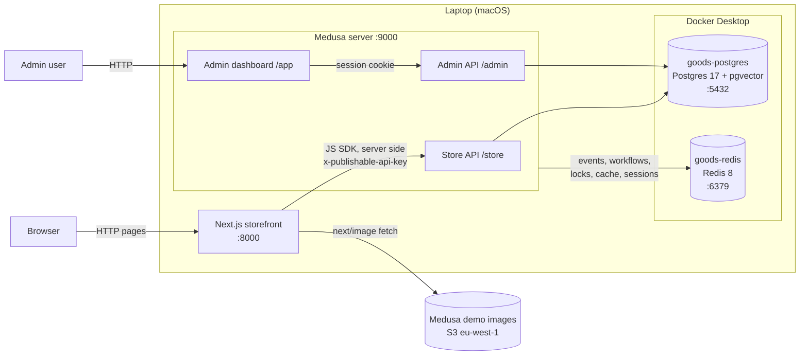

# Components running today

Local stack as of 9 October 2026. Only what runs now: no agent, worker, Stripe, or VPS yet.

- The storefront renders on the Next.js server, so the browser only talks to port 8000 for store pages.
- Medusa runs in shared mode: one process serves the APIs, the dashboard, and background jobs.
- Product images are the starter's demo images, hosted on Medusa's public S3 bucket.
