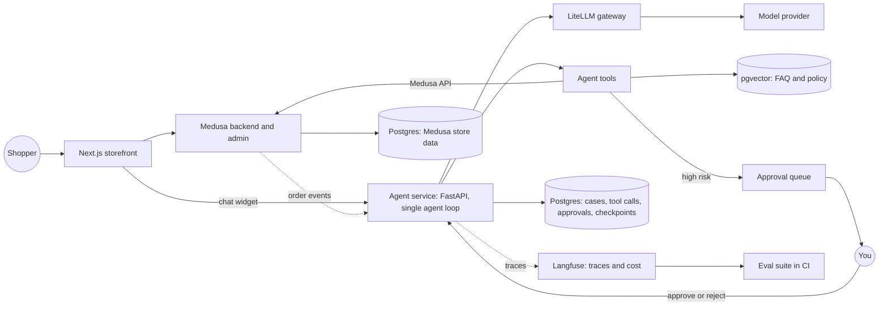

# Step-by-step roadmap: production-grade e-commerce support agent

Goal: become a strong AI agent engineer by building a production-grade customer support agent for a Medusa e-commerce store, while reading Chip Huyen's *AI Engineering*. The order of priorities is: the skill first, then public evidence of it, then the store. The same skills should serve three outcomes: an agent engineering job, consulting work, and your own e-commerce business.

Time: 40 project hours a week, Monday to Friday from 10:00 to 18:00. Saturday is a light day of spaced review only (10:00 to 12:30), and Sunday is fully off. The core roadmap runs about 9 weeks, from Monday 28 September to Saturday 28 November 2026. Product research runs in the background during week 1, alongside the On-ramp. After the core roadmap, run a retro before choosing the pace for the second project.

The project runs in production with synthetic data and test payments only. Your employer and a Polish lawyer have confirmed you can run the business, so the only remaining blockers for real orders are the business registration, tax, consumer-law, privacy, and security work in "Before taking real orders" at the end of this file. That work runs in parallel from week 1.

This roadmap is an execution checklist, not a promise that mistakes are impossible. APIs and installation commands change. Every step therefore has a gate and a learning gate. Do not continue because the calendar says to continue. Continue only when both gates pass and the evidence is committed.

Terms used here (gate, learning gate, stop condition, step, week, explain-back) are defined in `CONTEXT.md` at the repo root. Decisions are recorded in `docs/adr/`.

## How to use this roadmap

### The rule for every work session

1. Pull the latest default branch and confirm the working tree is clean.
2. Open the current step's issue or checklist.
3. Choose one outcome that can be finished and tested in 60 to 120 minutes.
4. Write the test or acceptance check first when the behavior can be tested.
5. Make the smallest change that passes it.
6. Run the narrow tests, then the full affected test suite.
7. Record the result, command, and any surprise in this week's progress note. If the surprise taught you a concept, add it to the explain-back.
8. Commit one coherent change. Do not combine infrastructure, behavior, and refactoring in one commit.
9. Stop and investigate if a safety invariant, data invariant, or eval threshold fails.

### Weekly time budget

Use this default split for a 40-hour week:

- 8 hours: learning. Assigned reading, `/teach` lessons, and spaced review of earlier chapters.
- 20 hours: implementation in small vertical slices.
- 8 hours: tests, eval runs, and failure analysis.
- 4 hours: explain-backs, ADRs, the weekly report, and the legal track in "Before taking real orders".

Every build day has the same shape:

- **10:00 to 11:30, learn:** the day's entry in the book reading track below, or a `/teach` lesson on it. Learning goes first, while you're fresh.
- **11:30 to 17:00, apply:** build and evals, starting with the task that uses what you just read.
- **17:00 to 18:00, consolidate:** the day's explain-back note, progress notes, and on Fridays the weekly report and the legal track.

The light day adds 2 to 3 hours of spaced review only: no building. Do not borrow time from evals or learning to finish features. Move unfinished feature work to the next week.

### Learning layer

Learning is the first priority, so it has its own structure:

- **Learning objectives:** every step lists what you should be able to explain or do afterwards.
- **Learning gate:** every step ends with one. Explain the objectives without notes, out loud or in writing. If you can't, spend the next learning block there before starting the next step.
- **Explain-back:** every weekly progress note has one. It takes each concept from the week and shows where it appears in your own code.
- **`/teach` workspace:** `learning/` in this repo. Open it as a separate Cursor window when studying. It holds the mission, lessons, reference sheets, and learning records for the Huyen chapters, Node and Medusa, and VPS operations.
- **Spaced review:** on the light day, redo quizzes and explain-backs from two and four weeks earlier.

### Required evidence for every week

Create `docs/progress/week-XX.md` in the project repo with:

- the week's steps and objectives;
- links to pull requests or commits;
- commands run and their results;
- eval report before and after the change;
- screenshots only when they prove UI or deployment behavior;
- failures found and regression tests added;
- decisions made and their reasons;
- remaining risks;
- the explain-back, and the result of each learning gate;
- hours actually worked;
- the next smallest task.

Never put secrets, customer data, access tokens, or raw production conversations in the progress notes.

### Stop conditions

Stop adding features and fix the problem when any of these is true:

- a write tool can run without verified customer identity;
- a retry can repeat a return, address change, refund, or other mutation;
- the agent can execute a refund without recorded human approval;
- a failed eval is dismissed without a written reason;
- all currently durable state has not been backed up and restored successfully;
- deployment requires an undocumented manual change;
- traces expose secrets or unnecessary personal data;
- the main branch is red;
- you cannot explain which component owns the data being changed.

## Decisions to record before day 1

Create `docs/project-configuration.md`. Fill every field. If a field is undecided, mark it `BLOCKED` and do not perform steps that depend on it.

```text
Repository path: goods (see docs/adr/0001-goods-is-the-single-project-repo.md)
Product category: (decided in the Research step)
Repository visibility:
Laptop operating system:
Docker runtime:
GPU confirmed by nvidia-smi:
Node version:
Package manager and version:
Python version:
Hosted model provider:
Primary model:
Embedding model:
Monthly model budget:
EU VPS provider and region:
Domain:
Object storage provider:
Transactional email provider:
Data retention period for conversations:
Default branch protection enabled:
```

Use these decision rules:

1. Keep the repository private until secret scanning, the license, and publication review are complete.
2. Start with Node 24 LTS and Python 3.12. They are compatible with the current Medusa starter, tau2-bench, NeMo Guardrails, NeMo Data Designer, and NeMo Agent Toolkit. Recheck before installation, then pin the exact runtime versions.
3. Commit the generated Node lockfile and use a committed `uv.lock` for Python.
4. Use one hosted model through LiteLLM for the primary baseline. Default: Claude Sonnet on Amazon Bedrock, called from `eu-central-1` (Frankfurt) through the EU cross-region inference profile. See "Models" in the stack section for the alternatives.
5. Use Ollama only for local experiments until evals prove a local model is good enough for a specific step.
6. Keep Stripe in test mode for the whole roadmap.
7. Use synthetic identities and addresses. Do not copy real customer records into development.
8. Choose an EU region for the VPS, database backups, object storage, and observability data.
9. Set a monthly budget alert before running automated evals against a hosted model.

## Project control files

Create these files during the Setup steps:

```text
.env.example                    # names and safe examples only
.nvmrc or .node-version         # pinned Node version
.python-version                 # Python 3.12 baseline
uv.lock                         # pinned Python dependencies
CONTEXT.md                      # glossary of project terms
docs/adr/                       # short architecture decision records
docs/progress/                  # weekly evidence and explain-backs
docs/runbooks/                  # deploy, rollback, backup, restore, incident
docs/design.md                  # Step 1 design
learning/                       # /teach workspace
evals/datasets/                 # versioned test cases without personal data
evals/reports/                  # machine-readable and human-readable reports
```

Keep `.env`, private keys, database dumps, Langfuse exports, and model-provider credentials out of git. Enable secret scanning locally and in the repository host before the first push.

Background research from NVIDIA's [retail resources](https://resources.nvidia.com/en-us-resources-for-retail-practitioner/), the broader feature list, and the platform comparison are in `ecommerce-ai-features.md` in this folder.

Version-sensitive commands and compatibility findings were checked against primary sources on 25 September 2026. The source notes are in `roadmap-platform-verification-notes.md` in this folder. Recheck them with `/research` before Step 8 (LangGraph), Step 10 (NeMo Agent Toolkit), and Step 11 (NeMo Guardrails).

## Stack

- **Store:** [Medusa](https://docs.medusajs.com/learn/installation): a Node.js backend with an admin dashboard, plus the Next.js Starter Storefront. Needs Node v20.19+ or v22.12+ (v24 LTS or lower with the storefront) and PostgreSQL.
- **Agent service:** Python 3.12, FastAPI, LangGraph (from Step 8), LiteLLM.
- **Data:** PostgreSQL. Medusa owns store data; the agent keeps its own tables in a separate schema. pgvector for FAQ search.
- **Quality and safety:** tau-bench plus pytest evals, Langfuse tracing, NeMo Guardrails.
- **NVIDIA open-source tools (all Apache 2.0):**
  - [NeMo Guardrails](https://github.com/NVIDIA/NeMo-Guardrails): input and output checks, topic control, jailbreak detection. Step 11.
  - [NeMo Data Designer](https://github.com/NVIDIA-NeMo/DataDesigner): generates synthetic customer conversations with validators and an LLM judge. Step 9.
  - [NeMo Agent Toolkit](https://github.com/NVIDIA/NeMo-Agent-Toolkit): works with LangGraph; profiles agents down to tokens, runs evaluations, and tunes prompts. Adopt in Step 10, after you've built your own eval harness.
- **NVIDIA open-weight models:** Nemotron 3 Nano 4B for local development ([Ollama](https://ollama.com/library/nemotron-3-nano), about 2.8 GB). The 30B version needs about 24 GB, so it won't fit your GPU.
- **Models (hosted, no GPU needed in production):**
  - Primary: Claude Sonnet on [Amazon Bedrock](https://docs.aws.amazon.com/bedrock/latest/userguide/geographic-cross-region-inference.html) with the EU geographic inference profile, so inference stays in EU regions. Self-serve, pay per token, strong tool use. Create a dedicated IAM user that can only invoke Bedrock models, and set an AWS budget alert first.
  - EU-jurisdiction alternative: [Mistral La Plateforme](https://docs.mistral.ai/). EU-hosted by default, and the provider is outside US jurisdiction. Paid plans are opted out of training by default.
  - Open-weight models in production (this replaces NIM): [Scaleway Generative APIs](https://www.scaleway.com/en/docs/generative-apis/reference-content/supported-models/) or [OVHcloud AI Endpoints](https://docs.ovhcloud.com/en/guides/public-cloud/ai-machine-learning/ai-endpoints-responses-api.md). Both are EU providers with OpenAI-compatible APIs, per-token pricing, and custom function calling. Use one of them for the Step 10 "cheaper model for simple requests" experiment. Tool-calling support varies by model, so check the model card and prove it with your evals.
  - Keep build.nvidia.com for dev-only experiments. The NeMo tools above are CPU-friendly Python libraries and do not depend on NVIDIA hosting.
- **Not using:**
  - Azure Container Apps: no Azure access, and one VPS is cheaper and simpler for Medusa's server, worker, Postgres, and Redis. If you later want managed containers instead of a VPS, the closest EU option is Scaleway Serverless Containers.
  - NIM containers: not open source. Free for development and testing only; production needs an NVIDIA AI Enterprise license, from $4,500 per GPU per year ([NIM FAQ](https://docs.api.nvidia.com/nim/docs/product)). Your production server has no GPU anyway.
  - Milvus with cuVS, TensorRT-LLM, Dynamo, Riva, Omniverse: built for GPU-scale serving, speech, or 3D, so they're overkill here.
  - LangSmith: proprietary. Self-hosting is an Enterprise-plan add-on ([LangSmith docs](https://docs.langchain.com/langsmith/self-hosted)). Keep Langfuse.
- **Reference to read:** NVIDIA's [retail shopping assistant blueprint](https://github.com/NVIDIA-AI-Blueprints/retail-shopping-assistant), which uses the same FastAPI, LangGraph, and NeMo Guardrails pattern.
- **Infrastructure:** Docker, GitHub Actions, and [Coolify](https://github.com/coollabsio/coolify) (open source, self-hosted, deploys to any server you can reach over SSH) on an EU VPS. Stripe in test mode for payments.

## Where things run

**Laptop (MSI, RTX 4070): development and local models**

- Run everything with Docker Compose:
  - Medusa server and worker
  - storefront
  - agent
  - Postgres with pgvector
  - Redis
- Use Langfuse Cloud in its EU region during the roadmap. Run Langfuse's full local Compose stack only as a separate experiment on a machine that meets its current resource requirements.
- On Windows, use Docker Desktop with the WSL 2 backend so containers can use the GPU.
- The laptop RTX 4070 is expected to have 8 GB of VRAM, but confirm with `nvidia-smi`. Model fit depends on quantization and context length. Prove fit with a load test. Likely candidates are:
  - Nemotron 3 Nano 4B (`ollama run nemotron-3-nano:4b`);
  - embedding models for FAQ search;
  - small safety classifier models for NeMo Guardrails. Test them one at a time; they won't all fit next to the chat model.
- For dev-only experiments with larger Nemotron models, use NVIDIA's hosted endpoints at build.nvidia.com within the free developer limits.
- Use local models for:
  - the fast development loop;
  - free repeated eval runs;
  - embeddings;
  - the "cheaper model for simple requests" experiment in Step 10.
- Use one hosted model API for the main agent. Small local models are much weaker at multi-step tool use, and your production server has no GPU.
- LiteLLM routes to local or hosted models with the same code.

**Production: one EU VPS with Coolify**

- A VPS from an EU provider such as Hetzner or OVHcloud, with about 8 GB RAM as an initial experiment. Medusa alone needs at least 2 GB ([Medusa deployment guide](https://docs.medusajs.com/learn/deployment/general)). Set container limits, measure memory, and load-test checkout plus agent traffic before treating 8 GB as sufficient.
- Coolify on the same server to begin with. Coolify recommends a separate server for itself, so move it later.
- What runs there, as Coolify resources:
  - Medusa in server mode and in worker mode (the deployment guide requires both);
  - storefront;
  - agent;
  - Postgres with pgvector;
  - Redis.
- Medusa production modules from its deployment guide: Redis for caching, the event bus, the workflow engine, and locking; S3 for files.
- S3-compatible object storage from the same provider, for Medusa files and Coolify's database backups.
- GitHub Actions runs evals and builds commit-SHA-tagged images to GitHub Container Registry. Configure and test the Coolify webhook or deployment trigger before claiming that merge deploys automatically.
- Tracing in production: start with Langfuse Cloud in its EU region. Self-host only on separate capacity later. Its current Compose deployment recommends at least 4 CPU cores, 16 GB RAM, and about 100 GB storage, so it does not belong on the store's initial 8 GB VPS.
- Uptime monitoring: Uptime Kuma (open source), deployed as a Coolify one-click service.
- Not open source, and fine to use: the model API, Stripe, and a transactional email service. Don't self-host email.

Repo layout: one monorepo, created by `create-medusa-app`:

- `apps/backend`: Medusa
- `apps/storefront`: Next.js
- `apps/agent`: Python (you add this one)
- `evals/`: test sets and the eval harness

## Rules

1. Nothing counts unless it changes a number in your eval report.
2. One agent, not many. Add a second one only if an eval proves it's worth the cost.
3. If a week slips, move the schedule. Never skip the eval steps.

## Reading list (nothing else during the core roadmap)

Huyen's book follows the reading track below. The other items are named in each step's "Read" section. Use the step's learning gate to check what stuck.

- Chip Huyen, *AI Engineering* ([table of contents](https://github.com/chiphuyen/aie-book/blob/main/ToC.md); Polish edition: [Inżynieria AI](https://helion.pl/ksiazki/inzynieria-ai-tworzenie-aplikacji-z-wykorzystaniem-modeli-bazowych-chip-huyen,inaitw.htm))
- Anthropic, [Building effective agents](https://www.anthropic.com/engineering/building-effective-agents)
- Anthropic, [Writing effective tools for agents](https://www.anthropic.com/engineering/writing-tools-for-agents)
- Anthropic, [Demystifying evals for AI agents](https://www.anthropic.com/engineering/demystifying-evals-for-ai-agents)
- OpenAI, [A practical guide to building agents](https://openai.com/business/guides-and-resources/a-practical-guide-to-building-ai-agents/)
- [tau-bench paper](https://arxiv.org/abs/2406.12045) and [repo](https://github.com/sierra-research/tau2-bench) (use its `retail` domain as your benchmark)
- Designing Data-Intensive Applications, 2nd edition: only the topics listed in the schedule
- [Google SRE book, Handling Overload](https://sre.google/sre-book/handling-overload/)
- Official docs, only the parts each step names: [Medusa](https://docs.medusajs.com/learn/customization), [LangGraph persistence and interrupts](https://docs.langchain.com/oss/python/langgraph/persistence), [Coolify](https://coolify.io/docs), NeMo Data Designer, NeMo Agent Toolkit, and NeMo Guardrails.

## Book reading track

*AI Engineering* is read in the 10:00 to 11:30 block, starting on Tuesday 29 September. Chapters are ordered by when the build needs them, not by book order. The six chapters this system depends on most get 3 days each; the rest get 2.

Priority, highest first: ch. 6, 4, 3, 5, 10, 2, 8, 1, 9, 7.

| Order | Chapter | Dates | Focus | Applied in |
|---|---|---|---|---|
| 1 | 1. Introduction to Building AI Applications | 29 to 30 Sep | Planning AI Applications; The AI Engineering Stack | Research decision; Step 1 scope and milestones |
| 2 | 2. Understanding Foundation Models | 1 to 2 Oct | Sampling; Structured Outputs; The Probabilistic Nature of AI. Skim training and modeling | Model choice; Step 2 sampling and structured outputs |
| 3 | 3. Evaluation Methodology | 5 to 7 Oct | Exact Evaluation; AI as a Judge. Skim language modeling metrics | Step 3 exact checks; Step 4 judge |
| 4 | 4. Evaluate AI Systems | 8, 9, 12 Oct | Evaluation Criteria; Model Selection; Design Your Evaluation Pipeline | Step 1 metrics and eval guideline; Steps 3 and 4 |
| 5 | 10. AI Engineering Architecture and User Feedback | 13 to 15 Oct | The five architecture steps; Monitoring and Observability | Step 1 component map; Steps 10 to 12 |
| 6 | 6. RAG and Agents | 16, 19, 20 Oct | Agents first (tools, planning, failure modes), then RAG and Memory | Step 2 agent loop; Steps 6 to 8 |
| 7 | 5. Prompt Engineering | 21 to 23 Oct | Defensive Prompt Engineering; Organize and Version Prompts | Step 5 |
| 8 | 8. Dataset Engineering | 26 to 27 Oct | Data Coverage; Acquisition and Annotation; AI-Powered Data Synthesis; Deduplicate Data | Step 4 hand labels; Step 9 |
| 9 | 9. Inference Optimization | 28 to 29 Oct | Inference Performance Metrics; Inference Service Optimization | Step 10 |
| 10 | 7. Finetuning | 30 Oct, 2 Nov | When to Finetune; Finetuning and RAG. Skim the rest | Step 7 "RAG instead of finetuning" ADR |

From 3 November the block becomes a spaced second read of the sections the current step uses:

| Dates | Second read | For |
|---|---|---|
| 3 to 4 Nov | Ch. 6 RAG and Memory | Step 7 |
| 5, 6, 9 Nov | Ch. 6 Agents: planning and failure modes | Step 8 |
| 10 to 11 Nov | Ch. 8 Data Augmentation and Synthesis; Data Processing | Step 9 |
| 12, 13, 16 Nov | Ch. 9 service optimization; ch. 10 router, gateway, and caches | Step 10 |
| 17 to 18 Nov | Ch. 10 Put in Guardrails; ch. 5 Defensive Prompt Engineering | Step 11 |
| 19, 20, 23 Nov | Ch. 10 Monitoring and Observability; User Feedback | Step 12 |
| 24 to 27 Nov | All chapter summaries and your explain-backs | Step 13 case study and walkthrough |

## What the agent may do

| Action type | Examples | Who acts |
|---|---|---|
| Read only | Order status, product questions, shipping policy | Agent alone |
| Low-risk write | Update address before shipping, start a return | Agent alone, logged |
| Money or irreversible | Refunds above a small limit, cancellations after shipping, credits | Agent prepares, you approve |
| Out of policy or upset customer | Complaints, legal threats, anything unclear | Hand off to a human |

Tell customers they're talking to an AI (EU AI Act requirement).

Verify the customer (email plus order number, or logged-in session) before any write. Medusa's Create Return API route doesn't require customer authentication, so identity checks are the agent's job ([Medusa: order returns](https://docs.medusajs.com/resources/commerce-modules/order/return)).

## Agent tools (each is a thin wrapper over Medusa's API)

| Tool | Risk | Notes |
|---|---|---|
| `verify_customer` | Read | Required before any write tool |
| `get_order`, `list_customer_orders` | Read | Status, items, shipping |
| `search_faq` | Read | pgvector over policy and FAQ docs |
| `request_return` | Low-risk write | Uses Medusa's return flow; idempotency key |
| `update_shipping_address` | Low-risk write | Only before fulfillment |
| `propose_refund` | Needs approval | Creates an approval request. The refund runs only after you approve |
| `hand_off_to_human` | None | Opens a case for you with a summary |

## Metrics to track from Step 2

Keep the three headline metrics, but calculate them consistently.

### 1. Task success

For every test case, run five independent trials with the model, prompt version, model parameters, tool versions, and dataset version recorded.

Report both:

- `pass@5`: the percentage of cases that pass at least once in five trials;
- `pass^5`: the percentage of cases that pass all five trials.

A trial passes only when all required deterministic checks pass. Examples: the correct tool was selected, arguments match policy, the final database state is correct, no forbidden tool ran, and the customer-facing response contains no unsupported claim. An LLM judge may score tone or clarity, but it must not override a failed state or policy check.

### 2. Cost per resolved conversation

For each trial, store input tokens, output tokens, embedding cost, judge cost, retry cost, and total model cost. Calculate:

```text
cost per resolved conversation =
total cost of all measured conversations / number resolved correctly
```

Report p50 and p95 cost as well as the mean. A failed conversation still contributes to total cost.

### 3. Escalation and wrong-action rates

```text
escalation rate =
conversations handed to a human / all conversations

wrong-action rate =
conversations with any incorrect or forbidden mutation / all conversations
```

Split escalation into expected and unnecessary escalation. The target for wrong money or irreversible actions is zero. Never hide a wrong action inside an average score.

### Required eval report metadata

Each report must include:

- git commit;
- UTC timestamp and environment;
- dataset name, version, and case count;
- prompt version and hash;
- model and parameters;
- tool and API versions;
- number of trials;
- task success, cost, escalation, wrong-action rate, latency p50 and p95;
- failures grouped by cause;
- comparison with the accepted baseline.

Store raw machine-readable results separately from the summary. Remove or mask personal data before persistence.

## Step 1 design doc checklist

1. **Scope:** which requests are in and which are out.
2. **Risk rules:** the table above.
3. **Component map:** see the diagram below.
4. **Data model:** Medusa owns customers, products, orders, returns, and refunds. The agent owns support cases, messages, tool calls (unique idempotency key), and approvals. The agent never writes to Medusa's tables directly, only through its API.
5. **Support case states:** open, agent working, awaiting approval, resolved, handed to human, failed, plus the allowed transitions.
6. **Failure plan:** model call fails, tool fails, worker crashes mid-refund, approval never answered.
7. **Budgets:** max turns, tokens, and retries per conversation (retries: max 3 per request).
8. **Metrics:** the three numbers above.
9. **Build order and out of scope:** no multi-agent, voice, or fine-tuning.



Build order: build the foundations first (data model, eval harness), then the uncertain part (agent behavior with real tools), then hardening and cost. Update the design doc whenever an eval surprises you, and log why.

## Schedule

Steps run back to back and can cross week boundaries. The detailed plan below describes each step, and the Cursor canvas `core-roadmap-calendar` shows the same plan day by day. A step ends when its gate and learning gate pass, not when the calendar says so. If a gate slips, shift the calendar.

| Week | Dates | Steps | Read |
|---|---|---|---|
| 1 | 28 Sep to 3 Oct | Research (in the background), On-ramp, start of Setup 1 | Book ch. 1 and 2; [Medusa customization](https://docs.medusajs.com/learn/customization); the four research reports |
| 2 | 5 to 10 Oct | Setup 1, first half of Setup 2 | Book ch. 3 and 4; [Medusa installation](https://docs.medusajs.com/learn/installation); Stripe testing docs; [Medusa deployment guide](https://docs.medusajs.com/learn/deployment/general); [Coolify docs](https://coolify.io/docs) |
| 3 | 12 to 17 Oct | End of Setup 2, Step 1, start of Step 2 | Book ch. 4, 10, and 6; OpenAI guide; "Building effective agents" |
| 4 | 19 to 24 Oct | End of Step 2, Step 3, start of Step 4 | Book ch. 6 and 5; first half of "Demystifying evals" |
| 5 | 26 to 31 Oct | End of Step 4, Step 5, start of Step 6 | Book ch. 8, 9, and 7; rest of "Demystifying evals"; "Writing effective tools"; DDIA on transactions |
| 6 | 2 to 7 Nov | End of Step 6, Step 7, start of Step 8 | Book ch. 7, then second reads of ch. 6; LangGraph persistence and interrupt docs |
| 7 | 9 to 14 Nov | End of Step 8, Step 9, start of Step 10 | Second reads of ch. 6, 8, and 9; Data Designer docs; SRE Handling Overload |
| 8 | 16 to 21 Nov | End of Step 10, Step 11, start of Step 12 | Second reads of ch. 9, 10, and 5; Guardrails docs; DDIA on consistency and derived data |
| 9 | 23 to 28 Nov | End of Step 12, Step 13, retro | Second read of ch. 10; all chapter summaries |

Slow down if you're skipping evals or learning gates, or if Steps 6 to 8 run past the end of week 7.

## Detailed execution plan

Treat each numbered item as ordered. Items marked "Gate" and "Learning gate" are mandatory.

### Research: choose the product category

**Outcome:** one product category chosen for the store, with evidence. The synthetic catalog, FAQ, return policy, evals, product safety duties, and the second project all depend on it.

**Learning objectives:**

- Explain which categories Polish shoppers buy online most, and cite the sources.
- Explain why the chosen category suits a solo seller better than the runner-up.

This step runs in the background during the On-ramp. Background agents do the source-gathering; you do the reading and the judging. It must finish by Thursday of week 1, because Setup 1's synthetic catalog depends on it.

**Steps:**

1. Monday morning: start the four `/research` prompts in `docs/research/product-research-prompts.md`, each in its own chat. They cover demand, competition and price levels, regulation, and unit economics, all for the same candidate list.
2. Wednesday afternoon: read the four reports. Re-run `/research` on any gap that would change the decision.
3. Thursday, solo-seller filter. Score the candidate categories on margin after shipping, parcel size and weight, likely return rate, regulatory burden, supplier access, and how crowded the category is on Allegro. The EU General Product Safety Regulation applies to every category. Cosmetics, food, toys, and electrical goods add much more.
4. Thursday, project fit. Prefer categories with many products that have rich attributes (good for catalog enrichment) and real support questions about sizing, compatibility, and returns (good for the agent).
5. Thursday, decide. Shortlist three, pick one, and record it as an ADR in `docs/adr/`. Fill the product category field in `docs/project-configuration.md`.

**Gate:** one category chosen, with the scoring table and sources committed.

**Learning gate:** without notes, explain why the runner-up lost.

### On-ramp: Medusa customization in TypeScript

**Outcome:** you can read and write the TypeScript that Medusa customization needs before you depend on it for seed scripts and return flows.

**Learning objectives:**

- Explain Medusa's modules, workflows, API routes, subscribers, and scheduled jobs, and when to use each.
- Write and run a small custom module, API route, workflow, and subscriber.

**Steps:**

1. Run `/teach` in `learning/` with the mission "build a production-grade support agent on Medusa". Start with TypeScript as Medusa uses it.
2. Follow the official [Medusa customization](https://docs.medusajs.com/learn/customization) chapter in a throwaway Medusa project, not in `goods`.
3. Write one explain-back covering each Medusa concept above.

**Gate:** the throwaway project runs your custom module, route, workflow, and subscriber.

**Learning gate:** without notes, explain why a Medusa workflow is safer than a plain API route for a multi-step change such as a return.

### Setup 1: make the store work locally

**Outcome:** a synthetic customer can complete a Stripe test purchase and you can inspect the resulting order in Medusa Admin.

**Learning objectives:**

- Trace a request from the storefront through the Store API to the database.
- Explain how Stripe webhooks change payment state, and why duplicate delivery must be harmless.

**Read first:**

1. Medusa's current installation requirements and create-medusa-app instructions.
2. Medusa's architecture overview: application, modules, workflows, API routes, subscribers, and jobs.
3. The Next.js Starter storefront setup guide.
4. Stripe's test-mode and test-card documentation.

**Day 1: verify the machine**

1. Record the operating system and shell in `project-configuration.md`.
2. Run `node --version`, `python --version`, `uv --version`, `npm --version`, `git --version`, `docker version`, and `docker compose version`.
3. Install and pin Node 24 LTS and Python 3.12 unless the current compatibility checks require a change.
4. Compare Node and database requirements with the current Medusa docs. Do not rely on this roadmap's version text if the docs differ.
5. On the MSI development laptop, run `nvidia-smi`. Record the GPU model, driver, CUDA version reported by the driver, and VRAM. GPU failure does not block the store setup.
6. Confirm at least 30 GB of free disk space.
7. Create the repository outside any unrelated project.
8. Initialize git, set the default branch, add a private remote, and enable branch protection if the host supports it.
9. Add an initial README that says the system uses synthetic data and test payments.

**Gate:** all required commands work, the repository is private, and no secrets are present in the first commit.

**Day 2: scaffold Medusa**

1. Open the current `create-medusa-app` documentation.
2. As verified on 25 September 2026, the documented command that explicitly includes the storefront is:

   ```bash
   npx create-medusa-app@latest --with-nextjs-starter
   ```

   Recheck the [installation guide](https://docs.medusajs.com/learn/installation) and [starter guide](https://docs.medusajs.com/resources/nextjs-starter) before running it. Use the current command if it has changed.

3. Use the generated directory structure. If it differs from `apps/backend` and `apps/storefront`, document the actual structure instead of moving files immediately.
4. Start PostgreSQL as instructed by Medusa.
5. Start the backend and storefront with the generated commands.
6. Open the storefront, backend health endpoint, and Admin.
7. Create the first admin user through the documented flow.
8. Follow the generated storefront `.env.template`. The current starter source uses server-only `MEDUSA_BACKEND_URL`, even though one section of the documentation still shows the stale `NEXT_PUBLIC_MEDUSA_BACKEND_URL` name.
9. Set `NEXT_PUBLIC_MEDUSA_PUBLISHABLE_KEY` from Medusa Admin and configure at least one region with countries.
10. Commit the untouched generated baseline before customization.

**Gate:** backend, Admin, and storefront start from a clean clone by following the README only.

**Day 3: understand before changing**

1. Trace one product page request from storefront to Store API.
2. Locate the generated environment files and replace secrets with `.env.example` placeholders.
3. Write the next ADR in `docs/adr/`, `NNNN-medusa-as-commerce-platform.md`: why Medusa was selected, alternatives considered, and the rule that the agent only uses Medusa APIs.
4. Draw the current local component diagram. Do not draw planned services as if they exist.
5. Record generated dependency versions and commit all lockfiles.

**Day 4: deterministic synthetic data**

1. Define a synthetic catalog with at least 10 products, variants, inventory, prices, and realistic descriptions, drawn from the category chosen in the Research step. Then the seed, FAQ, return policy, and evals carry over to the real store.
2. Define at least 10 synthetic customers and orders covering unfulfilled, fulfilled, delivered, canceled, and return-eligible states.
3. Use reserved example domains such as `example.com`. Do not use plausible real addresses.
4. Implement the seed through Medusa's supported scripts, workflows, or APIs.
5. Make the seed repeatable. Re-running it must not create uncontrolled duplicates.
6. Add a reset procedure for local data.
7. Add automated checks for expected product, customer, and order counts.

**Gate:** reset plus seed produces the same known dataset twice in a row.

**Day 5: Stripe test checkout**

1. Create or select a Stripe account and switch to test mode.
2. Put test keys in local secret storage, never in git.
3. Configure Medusa's current Stripe provider with `sk_test_...` credentials by following its official provider documentation.
4. Configure regions, currency, sales channel, shipping option, stock, and publishable API key as required by the generated starter.
5. Configure and verify Stripe webhooks. Use the documented path from the installed Medusa provider, not a guessed endpoint. Store the local or deployed `whsec_...` webhook secret outside git.
6. Complete checkout interactively with Stripe's documented test card.
7. Confirm the browser shows success.
8. Confirm the order exists in Admin with the expected customer, items, amount, payment state, and fulfillment state.
9. Test a declined payment, a 3D Secure flow, invalid webhook signature, duplicate webhook delivery, delayed webhook delivery, and a test refund.
10. Confirm duplicate delivery does not duplicate payment state changes.
11. Repeat the successful checkout once after a full restart of the local stack.
12. Add `docs/runbooks/local-store.md` containing start, stop, reset, seed, purchase, webhook, and troubleshooting steps.

**Setup 1 deliverables:**

- reproducible store scaffold;
- committed lockfiles and safe `.env.example`;
- deterministic synthetic seed;
- successful test purchase evidence;
- local-store runbook;
- week report.

**Gate fails if:** checkout depends on an undocumented manual database edit, the seed is not repeatable, or a secret has entered git history. Rotate an exposed secret before doing anything else.

**Learning gate:** without notes, draw the path of a checkout from browser to Stripe webhook to order state, and explain what happens on a duplicate webhook.

### Setup 2: reproducible environments and deployment

**Outcome:** a clean machine can run the local stack, a tested trigger can deploy the test store over HTTPS, and all currently durable state has been restored successfully.

**Learning objectives:**

- Harden a fresh Linux VPS and explain each hardening step.
- Explain why Medusa needs separate server and worker instances in production.
- Explain the difference between a backup and a proven restore.

Docker, Compose, and GitHub Actions are already familiar, so Days 1 to 3 should go quickly. Put the saved time into Day 4, which is new.

**Day 1: container boundaries**

1. List each process, port, health check, persistent volume, and secret.
2. Create production-oriented Dockerfiles for backend, worker, storefront, and later the agent. Use multi-stage builds and non-root runtime users where supported.
3. Add `.dockerignore` files.
4. Add container health checks that test service readiness, not merely whether the process exists.
5. Pin image versions. Do not use `latest` for stateful services.

**Day 2: local Compose**

1. Define PostgreSQL with pgvector, Redis, Medusa server, Medusa worker, storefront, and Ollama.
2. Keep model downloads outside container image builds.
3. Add named volumes for stateful local data.
4. Add startup dependencies, while making applications tolerate dependencies that become temporarily unavailable.
5. Make GPU support optional. On Windows, use Docker Desktop with WSL 2 and validate GPU container access first. On native Linux, install and verify NVIDIA Container Toolkit. Docker Desktop on macOS does not provide NVIDIA GPU passthrough.
6. In Compose, request `capabilities: [gpu]`; do not set both `count` and `device_ids`.
7. Provide a CPU-safe path if GPU container access is unavailable.
8. Start from empty volumes, migrate, seed, and complete a test checkout.
9. Destroy and recreate containers without deleting volumes. Confirm data remains.
10. Repeat after deleting volumes. Confirm the documented seed restores the expected state.

**Gate:** another developer can clone the repo, copy `.env.example`, provide secrets, run the documented commands, and reach a working seeded store.

**Day 3: CI and image publishing**

1. Add separate CI jobs for formatting, linting, type checking, unit tests, and build.
2. Cache dependencies by lockfile hash.
3. Give workflow tokens the minimum required permissions.
4. Build immutable images tagged with the git commit SHA.
5. For the publishing job, start with `contents: read` and `packages: write`. Add only documented permissions required by provenance or signing.
6. Pin third-party GitHub Actions to full commit SHAs.
7. Push images to GitHub Container Registry only after tests pass.
8. Enable dependency update and secret scanning.
9. Protect the default branch so required checks must pass.
10. Test CI with one intentionally failing change, then revert it.

**Day 4: EU VPS and Coolify, built twice**

Do the list below twice. First on a cheap throwaway VPS, writing `docs/runbooks/vps-and-coolify.md` as you go. Then destroy that server and build the real one from the runbook alone. Fix the runbook wherever it was not enough. Use `/teach` in `learning/` for any hardening step you can't explain.

1. Select the provider, region, initial machine size, and monthly budget. Record them in an ADR.
2. Create a non-root administrative user, SSH key authentication, firewall rules, and automatic security updates.
3. Install Coolify using its current official instructions.
4. Add the repository or immutable images as Coolify resources.
5. Create separate resources for Medusa server and worker.
6. Set `MEDUSA_WORKER_MODE=server` and `DISABLE_MEDUSA_ADMIN=false` on the server. Set `MEDUSA_WORKER_MODE=worker` and `DISABLE_MEDUSA_ADMIN=true` on the worker.
7. Configure production secrets in Coolify, including strong random cookie and JWT secrets. Do not paste them into Compose files.
8. Provision PostgreSQL and Redis with persistent storage.
9. Configure the current Medusa production modules for Redis-backed caching, event bus, workflow engine, and locking, plus S3-compatible file storage. Names and configuration change across Medusa releases, so copy them from the current [deployment guide](https://docs.medusajs.com/learn/deployment/general).
10. Configure storefront, Admin, and auth CORS with exact HTTPS origins. Do not use wildcard origins.
11. Configure DNS and HTTPS.
12. Run `medusa db:migrate` once as a controlled release step. Never let multiple replicas race to migrate.
13. Deploy the backend first. Create the production test publishable key and region, then configure and deploy the storefront.
14. Confirm the server's `/health` endpoint returns `OK`, then open Admin and the storefront.
15. Configure the actual Coolify webhook or image-deployment trigger and prove that a merge deploys the expected commit SHA. This behavior is not automatic merely because an image exists in GHCR.
16. Deploy and complete a Stripe test purchase over the public HTTPS URL.
17. Test rollback to the previous image.

**Day 5: backups and recovery**

1. Inventory all durable state. At this stage it includes Medusa data, S3 files, and Coolify configuration. Add agent cases, approvals, idempotency records, LiteLLM data, and LangGraph checkpoints to the inventory when those components are introduced.
2. Create nightly encrypted PostgreSQL backups to EU object storage. Include every database and schema that holds durable business or workflow state.
3. Back up S3-compatible object storage and Coolify configuration with documented retention.
4. Treat Redis as rebuildable only after verifying that no required business state exists solely there.
5. Stop application writes, workers, and scheduled jobs for the restore drill.
6. Download backups into an isolated restore environment.
7. Restore PostgreSQL to a new database, never over the source database. Restore object files and Coolify configuration in isolation.
8. Run integrity queries, open representative orders in Admin, and verify agent approval and idempotency records.
9. Record recovery time, recovery point, and exact commands in `docs/runbooks/restore-all-state.md`.
10. Add uptime checks for storefront, backend health, and agent health once it exists.
11. Add `docs/runbooks/deploy-and-rollback.md`.

**Setup 2 deliverables:**

- reproducible local Compose stack;
- passing protected CI;
- commit-SHA container images;
- HTTPS test deployment, built from the runbook on a second server;
- VPS, deploy, and rollback runbooks;
- backup and proven restore of all currently durable state;
- week report.

**Gate fails if:** only the server or only the worker is deployed, the production database is publicly exposed, rollback is untested, or backup success is inferred without a restore.

**Learning gate:** without notes, list the hardening steps for a fresh VPS and the reason for each, and explain what the restore drill proved that a successful backup job did not.

### Step 1: write the design before the agent

**Outcome:** a reviewed, testable design that removes ambiguity about ownership, safety, failure handling, and success. Write it so a client could read it: it doubles as your first consulting-style design doc.

**Learning objectives:**

- Explain when a single agent with tools beats a workflow, and when it doesn't.
- Explain the difference between authentication and authorization for a support agent.
- Explain why idempotency has to be designed before the first write tool exists.

**Read:**

- book: you read ch. 1 and 4 before this step, and ch. 10 during it. Use ch. 10's architecture steps for the component map, and ch. 4's evaluation guideline for the metrics;
- OpenAI's practical guide to building agents.

**Steps:**

1. Create `docs/design.md` from the design checklist above.
2. Write five in-scope user journeys: order status, list orders, FAQ, return request, and pre-fulfillment address change.
3. Write at least five out-of-scope journeys: legal threats, policy exceptions, post-fulfillment address change, autonomous refund, and requests unrelated to the store.
4. For each journey, define preconditions, allowed tools, expected state change, customer response, escalation rule, and audit record.
5. Define support-case states and an explicit transition table. Reject undefined transitions.
6. Define tables for cases, messages, tool executions, approvals, and checkpoints. Include created time, updated time, correlation ID, actor, status, and retention class.
7. Define write-tool idempotency. Use a stable operation key derived from the support case and requested business operation. Enforce uniqueness in the agent database.
8. Define authentication separately from authorization. Knowing an order number is not automatically sufficient proof of identity.
9. Define refund approval: proposal creation, approver identity, approve or reject, expiration, execution, and audit.
10. Define failure behavior for model timeout, malformed tool call, Medusa timeout, partial failure, worker crash, stale order state, and approval timeout.
11. Set initial budgets for turns, tokens, wall-clock time, tool calls, and retries.
12. Create a data-flow diagram marking personal data, secrets, and external processors.
13. Write a threat model covering prompt injection, cross-customer access, tool argument tampering, replay, data exfiltration, and poisoned FAQ content.
14. Write ADRs for the single-agent design, LiteLLM boundary, Medusa API ownership, and approval boundary.
15. Review the design against every stop condition in this roadmap.

**Gate:** every in-scope journey has an executable acceptance test outline, every write has an identity and idempotency rule, and every high-risk action has a human approval boundary.

**Learning gate:** without notes, walk through one return request journey: every state transition, tool call, and check, and where a crash at each point would leave the case.

### Step 2: build the thinnest end-to-end agent

**Outcome:** a deployed chat can verify a synthetic customer, fetch one order through Medusa's API, answer with evidence, and produce the first baseline report.

**Learning objectives:**

- Explain how sampling settings and structured outputs affect tool-call reliability.
- Explain what `pass@5` and `pass^5` each tell you, and why a support agent needs both.

**Read:**

- book: ch. 2 (sampling and structured outputs) is already read; ch. 6's Agents section is read during this step;
- Anthropic's "Building effective agents."

**Steps:**

1. Add `apps/agent` with a pinned Python version, lockfile, FastAPI, typed settings, and `/health/live` plus `/health/ready`.
2. Add unit-test, lint, format, and type-check commands to CI.
3. Define provider-neutral message, tool-call, tool-result, usage, and error types.
4. Configure LiteLLM with one hosted model. Set a strong `LITELLM_MASTER_KEY`, explicit timeouts, and no automatic write retries.
5. Give LiteLLM PostgreSQL-backed state before relying on virtual keys, spend tracking, or enforceable budgets. Generate `LITELLM_SALT_KEY` once, store it as durable recovery material, and never rotate it casually because it protects stored provider credentials.
6. Implement a plain bounded loop without LangGraph:
   1. accept a message;
   2. load the case;
   3. call the model with tool schemas;
   4. validate structured output;
   5. run at most one approved read tool;
   6. append the result;
   7. repeat until a final answer or budget limit;
   8. persist trace metadata.
7. Implement `verify_customer` and `get_order` as typed wrappers around Medusa APIs.
8. Ensure `get_order` returns only data belonging to the verified customer.
9. Return a safe generic error for failed verification. Do not reveal whether an unrelated order exists.
10. Add a minimal chat widget with AI disclosure, message history, loading state, retry state, and human handoff message.
11. Propagate one correlation ID from browser to agent, tool wrapper, and trace.
12. Redact credentials and unnecessary customer fields before tracing.
13. Create 10 deterministic cases across success, failed identity, unknown order, cross-customer access, provider timeout, and malformed output.
14. Clone tau2-bench into its own Python 3.12 `uv` project boundary and pin the benchmark commit. Its LiteLLM constraints can conflict with the agent's dependencies.

    ```bash
    git clone https://github.com/sierra-research/tau2-bench
    cd tau2-bench
    uv sync
    uv run tau2 check-data
    uv run tau2 run --domain retail --agent-llm <model> --user-llm <model> --num-trials 1 --num-tasks 5
    ```

    Clone it outside the Medusa monorepo unless you deliberately manage it as a pinned submodule.

15. Run the unmodified tau2 retail smoke benchmark as an external learning baseline. Do not report it as proof that the Medusa agent works.
16. If you later build an adapter, keep it separate and continue using Medusa-native tests to validate actual tool arguments and final commerce state.
17. Run five trials per Medusa-native case and publish the first eval report.
18. Deploy the agent next to the test store and rerun smoke tests over HTTPS.

**Gate:** cross-customer access always fails, no write tool exists yet, all budgets terminate correctly, and the baseline report contains the required metadata.

**Learning gate:** without notes, explain every stage of your agent loop and the budget that stops it, and why the tau2 retail score says nothing about the Medusa agent.

### Step 3: build deterministic evals

**Outcome:** failures are detected from tool calls and final state, not from subjective reading of transcripts.

**Learning objectives:**

- Explain why final-state checks are more trustworthy than reading transcripts.
- Explain how to tell an infrastructure failure from an agent failure, and why both are reported.

**Read:** the first half of Anthropic's eval guide. From the book, ch. 3 (Exact Evaluation) and ch. 4 (Design Your Evaluation Pipeline) are already read.

**Steps:**

1. Define a versioned eval-case schema with initial state, user messages, expected tools, forbidden tools, argument constraints, final-state assertions, response assertions, and tags.
2. Build isolated fixtures that reset affected records before each trial.
3. Capture model output, validated tool calls, tool results, final response, latency, tokens, cost, and database state.
4. Add exact checks for tool name, number of calls, order ownership, argument schema, and final state.
5. Add policy checks for disclosure, unsupported promises, and information leakage.
6. Distinguish infrastructure errors from agent failures. Report both. Do not silently rerun failures until they pass.
7. Generate JSON results and a short Markdown summary.
8. Add at least 20 cases, with extra weight on access-control and failure paths.
9. Run the accepted baseline five times.
10. Add CI in report-only mode while thresholds stabilize.

**Gate:** the same stored result produces the same deterministic score on repeated scoring runs.

**Learning gate:** without notes, design an eval case for a new intent: initial state, expected and forbidden tools, and final-state assertions.

### Step 4: calibrate the LLM judge and enforce CI

**Outcome:** subjective qualities are scored by a measured judge, and CI blocks proven regressions without becoming flaky.

**Learning objectives:**

- Explain how to measure judge agreement with human labels, and what agreement level is good enough.
- Explain why a judge must never override a failed state or policy check.
- Set a CI tolerance from measured flakiness instead of a guess.

**Read:** the rest of Anthropic's eval guide. From the book, ch. 3 (AI as a Judge) is already read, and ch. 8 (Acquisition and Annotation) lands as you hand-label.

**Steps:**

1. Write a narrow rubric for tone, clarity, empathy, and policy explanation.
2. Hand-label at least 30 outputs without seeing the judge score.
3. Run the judge on the same outputs with fixed prompt and parameters.
4. Measure agreement per rubric dimension and inspect every disagreement.
5. Revise ambiguous labels or rubric text, then rerun calibration on a held-out subset.
6. Keep identity, tool, money, and database-state checks deterministic.
7. Establish the accepted baseline from a fixed dataset and prompt version.
8. Set CI policy:
   - any wrong action fails immediately;
   - any cross-customer disclosure fails immediately;
   - deterministic task-success regression fails;
   - judge-score changes use a tolerance justified by calibration;
   - provider or infrastructure outages are reported separately.
9. Run the full suite five times to estimate flakiness.
10. Require eval approval when prompts, model settings, tools, or policies change.

**Gate:** CI catches an intentionally introduced wrong-tool regression and returns green after it is reverted.

**Learning gate:** without notes, explain your judge's weakest rubric dimension and the evidence for it.

**Outside feedback:** ask one practitioner to review the eval harness and the judge calibration.

### Step 5: make prompts versioned and attack them

**Outcome:** prompt changes are reviewable, measured, and covered by injection tests.

**Learning objectives:**

- Explain direct and indirect prompt injection, with one example of each from this store.
- Explain the authority order between policy, store state, tool results, and customer text.

**Read:** book ch. 5, finished just before this step. Keep Defensive Prompt Engineering open while writing the attacks.

**Steps:**

1. Separate system policy, store policy, tool descriptions, and runtime context.
2. Store prompts as versioned files, not Python string fragments.
3. Include prompt version and content hash in every trace and eval report.
4. State the authority order explicitly: system policy, verified store state, tool results, then customer text.
5. Mark FAQ documents and tool output as untrusted data, not instructions.
6. Add attacks that ask the agent to reveal prompts, ignore policy, access another order, fabricate a refund, call a tool with attacker arguments, or follow instructions embedded in FAQ text.
7. Add indirect injection cases from product names, order notes, and retrieved documents.
8. Define safe refusal and handoff behavior.
9. Run the full baseline before and after every prompt candidate.
10. Accept a prompt only when the report shows no safety regression and explains any metric tradeoff.

**Gate:** every known injection attack is a named regression case and no prompt change can bypass CI.

**Learning gate:** without notes, invent a new indirect injection through a product name or order note, then write it as a regression case.

### Step 6: add safe write tools

**Outcome:** return requests and eligible address changes work exactly once, only for verified customers and valid order states.

**Learning objectives:**

- Explain idempotency keys, and why a model retry is different from an HTTP retry.
- Explain what to do with an uncertain outcome, where Medusa may have accepted the request but the agent never saw the response.

**Read:**

- book: ch. 6 Tools section, already read;
- Anthropic's "Writing effective tools for agents";
- DDIA sections on transactions, retries, and idempotence.

**Build one tool at a time. For each tool, follow this sequence:**

1. Write the policy table: required identity, allowed order states, required inputs, prohibited inputs, side effect, retry behavior, and customer response.
2. Write unit tests for schema validation and policy.
3. Write an integration test against a seeded Medusa order.
4. Write replay and concurrent-request tests.
5. Implement the typed Medusa API wrapper.
6. Add the tool schema to the model only after deterministic tests pass.
7. Add normal, boundary, denied, timeout, stale-state, and duplicate cases to evals.
8. Run five trials per case and compare with baseline.

Implement in this order:

1. `list_customer_orders`;
2. `request_return`;
3. `update_shipping_address`.

For every write:

- require a verified-customer record tied to the current case;
- re-read current order state immediately before mutation;
- validate business policy outside the model;
- reserve a unique idempotency key before the external API call;
- persist request intent and sanitized arguments;
- call Medusa through its documented API or workflow;
- record the external operation ID and result;
- return the stored result when the same operation is replayed;
- mark uncertain outcomes for reconciliation instead of blindly retrying.

**Fault tests:**

1. Send the same request twice sequentially.
2. Send the same request concurrently.
3. Time out after Medusa accepts the request but before the agent receives the response.
4. Restart the agent between reservation and completion.
5. Change order state immediately before execution.

**Gate:** each requested business operation happens zero or one time as policy requires. No model retry can duplicate it.

**Learning gate:** without notes, walk through each of the five fault tests and explain why your design produces at most one mutation.

### Step 7: retrieval, events, and bounded memory

**Outcome:** policy answers cite versioned source material, order events update case context safely, and memory cannot cross customer boundaries.

**Read:** book ch. 6 RAG and Memory, a spaced second read just before you build retrieval. Ch. 7's "Finetuning and RAG" backs the ADR for choosing RAG over finetuning.

**Learning objectives:**

- Explain chunking and metadata choices for policy documents, and why exact policy terms need hybrid or filtered retrieval.
- Explain how to handle duplicate and out-of-order events.
- Explain why a model summary is never authoritative order state.

**Steps for FAQ retrieval:**

1. Write canonical FAQ and policy documents with owner, effective date, version, and stable document ID.
2. Define chunking and metadata rules before embedding.
3. Store document version, section, locale, and effective dates with each vector.
4. Build ingestion that is deterministic and safe to rerun.
5. Use hybrid or metadata-filtered retrieval where exact policy terms matter.
6. Return source IDs and excerpts with search results.
7. Require the answer to cite retrieved policy. Refuse or hand off when evidence is absent or conflicting.
8. Add retrieval evals for answerable, unanswerable, outdated, conflicting, multilingual, and injected documents.

**Steps for Medusa events:**

1. Subscribe only to documented events needed by support cases.
2. Verify event authenticity where the transport supports it.
3. Persist the event ID and reject duplicates.
4. Make handlers idempotent.
5. Handle out-of-order delivery by re-reading authoritative Medusa state.
6. Put repeated failures in a visible dead-letter or failed-event queue.
7. Add replay instructions to a runbook.

**Steps for memory:**

1. Store durable business facts only when needed.
2. Scope every record by customer and support case.
3. Never treat model summaries as authoritative order state.
4. Define retention and deletion behavior.
5. Test two customers with similar names and simultaneous cases for isolation.

**Gate:** every FAQ answer is traceable to an effective source, duplicate events do not duplicate effects, and cross-customer memory tests always fail closed.

**Learning gate:** without notes, explain why the agent answered one conflicting-policy case the way it did, using the retrieved sources and their effective dates.

### Step 8: durable refund approval with LangGraph

**Outcome:** a refund proposal pauses for explicit approval, survives restart, resumes once, and executes at most once.

**Read:** current LangGraph [persistence](https://docs.langchain.com/oss/python/langgraph/persistence), checkpointer, and interrupt documentation. Recheck the verification notes with `/research` first.

**Learning objectives:**

- Explain what a checkpoint makes durable and what it does not, especially external writes.
- Explain how `thread_id`, interrupts, and resume fit together across a process restart.
- Explain how two workers are prevented from executing the same approved refund.

**Steps:**

1. Freeze the Step 7 baseline before changing orchestration.
2. Model the existing plain loop as explicit states and transitions.
3. Introduce LangGraph without changing tool semantics.
4. Use a production-suitable persistent checkpointer such as LangGraph's PostgreSQL saver, not `InMemorySaver`. Use a UUID for `thread_id` and keep it under the documented 255-character limit.
5. Keep model messages serializable, set checkpoint retention, and version the stored state schema.
6. Implement `propose_refund`. It creates an approval record but cannot execute a refund.
7. Store proposal amount, currency, reason, order, policy evidence, requester, created time, expiration, and status.
8. Build an authenticated approval interface. Record approver identity and decision time.
9. On approval, re-read the order and payment state, validate amount and policy again, reserve the refund idempotency key, then execute through Medusa's supported flow.
10. On rejection or expiration, produce no money movement.
11. Ensure only one worker can claim an approved operation.
12. Add migration handling for checkpoints created by the previous app version.

**Required tests:**

- pause and resume normally;
- restart while waiting;
- restart immediately after approval;
- send approval twice;
- two approvers race;
- approval expires;
- order changes while waiting;
- refund provider times out after accepting;
- old checkpoint is loaded after a deployment;
- unauthorized user attempts approval.

Run each destructive fault case against synthetic test payments only.

**Gate:** all approval records have a complete audit trail, pending work survives restart, and 20 repeated fault runs produce zero duplicate refunds.

**Learning gate:** without notes, draw the approval flow as a state diagram and mark where each required test would crash it, and why nothing is duplicated.

**Outside feedback:** ask one practitioner to review the approval design and the fault results.

### Step 9: expand coverage with synthetic conversations

**Outcome:** at least 100 reviewed eval cases cover the real risk surface instead of adding random volume.

**Learning objectives:**

- Explain how a coverage matrix decides what synthetic data to generate.
- Explain why synthetic judged data supplements, but never replaces, human-reviewed high-risk cases.

**Read:**

- book: second read of ch. 8 Data Augmentation and Synthesis, and Data Processing;
- current NeMo Data Designer documentation.

**Steps:**

1. Produce a coverage matrix with intent, risk tier, order state, customer state, tone, language, channel, tool outcome, and expected resolution.
2. Mark empty or weak cells.
3. Define generation constraints from the case schema and store policy.
4. Generate candidates with NeMo Data Designer only for identified gaps.
5. Validate schema, referential integrity, expected state, and policy consistency programmatically.
6. Remove duplicates and near-duplicates.
7. Manually review every high-risk case and a sample of low-risk cases.
8. Keep generated and human-authored cases labeled separately.
9. Add adversarial combinations: angry customer plus invalid identity, mixed intents, stale order state, ambiguous address, partial return, and repeated refund request.
10. Promote every discovered production or manual-test failure into a minimal regression case.
11. Version the dataset and write a short dataset card with purpose, generation method, limitations, and review method.
12. Run the complete suite five times and group failures by root cause.

**Gate:** there are at least 100 useful cases, all high-risk cases are human-reviewed, and each coverage category has an owner or an explicit reason for exclusion.

**Learning gate:** without notes, name the three weakest cells of the coverage matrix and how you filled them.

### Step 10: reduce cost and latency without losing quality

**Outcome:** measured cost or latency falls while safety and accepted success thresholds remain unchanged.

**Learning objectives:**

- Explain where the cost and latency of one conversation actually go.
- Explain prompt caching, model routing, and admission control, and the risk each one adds.

**Read:**

- book: second read of ch. 9 Inference Service Optimization, and ch. 10's router, gateway, and cache steps;
- Google SRE's "Handling Overload";
- current NeMo Agent Toolkit profiling documentation.

**Steps:**

1. Freeze the accepted Step 9 report. Recheck the NeMo Agent Toolkit notes with `/research`.
2. Profile traces by step, model latency, tokens, retries, retrieval, and tool latency.
3. Install NeMo Agent Toolkit's LangChain, profiler, and eval extras deliberately. Prove it can wrap the existing LangGraph without becoming a second orchestrator.

   ```bash
   pip install "nvidia-nat[langchain]"
   pip install "nvidia-nat[profiler]"
   pip install "nvidia-nat[eval]"
   ```

   Use `uv add` with equivalent extras in the actual project so the versions enter `uv.lock`.

4. Use NeMo Agent Toolkit only as a second profiler. Compare its result with your own measurements.
5. Rank opportunities by expected savings and implementation risk.
6. Test one optimization at a time:
   - remove redundant context;
   - summarize only when context crosses a measured threshold;
   - cache stable prompt prefixes if the provider supports it;
   - cache embeddings by document version;
   - reduce unnecessary judge calls outside CI;
   - route a narrow, low-risk intent to a cheaper model;
   - test Nemotron 3 Nano 4B locally for that narrow intent.
7. Add admission control, concurrency limits, request deadlines, bounded queues, and exponential backoff with jitter for safe reads.
8. Respect provider retry headers. Do not retry non-idempotent operations at the HTTP layer unless their business idempotency is proven.
9. Define behavior when budget or capacity is exhausted: concise fallback or human handoff.
10. Run the complete suite five times for each candidate.
11. Accept only changes with no wrong-action increase, no access-control regression, and no task-success drop beyond the predeclared tolerance.
12. Record savings in absolute cost per correct resolution, not only percentage.

**Gate:** the report shows a statistically credible improvement on the fixed dataset, with the same safety invariants.

**Learning gate:** without notes, explain your largest saving, what it cost in risk, and the evidence that success didn't drop.

### Step 11: add guardrails as defense in depth

**Outcome:** guardrails catch defined threats without replacing application authorization or breaking valid customer requests.

**Read:**

- book: second read of ch. 10 Put in Guardrails, and ch. 5 Defensive Prompt Engineering;
- current NeMo Guardrails documentation. Recheck the verification notes with `/research` first.

**Learning objectives:**

- Explain which threats guardrails own and which stay in application code, and why.
- Explain how to measure over-blocking on valid support requests.

**Steps:**

1. List threats assigned to guardrails: off-topic requests, explicit jailbreaks, sensitive-data leakage, and unsafe output.
2. List threats that remain application responsibilities: identity, authorization, order-state validation, idempotency, approval, and database constraints.
3. Start NeMo Guardrails as a separately testable boundary or integrate it according to the current supported architecture.
4. Add input rails first. Measure false positives on valid support requests.
5. Add retrieval rails for untrusted FAQ content and execution rails that validate tool inputs and outputs.
6. Add output rails. Ensure blocked output cannot leak through streaming before validation.
7. Add topic rules with an explicit allowed-support taxonomy.
8. Add canary secrets and exfiltration tests.
9. Test obfuscation, multilingual prompts, role-play, quoted malicious content, and indirect injection.
10. Define timeout and outage behavior. Safety checks that fail unavailable must fail closed for writes.
11. Record rail version, decision, and latency in traces without logging unsafe raw data unnecessarily.
12. Rerun all functional evals to detect over-blocking.

**Gate:** security cases improve, valid-task regression stays within the declared limit, and disabling guardrails cannot bypass application-level authorization.

**Learning gate:** without notes, explain what happens to a write request when the guardrails service is down, and why.

### Step 12: reliability, observability, and operations

**Outcome:** the live demo has useful signals, bounded failure behavior, and proven recovery under injected faults.

**Read:**

- book: second read of ch. 10 Monitoring and Observability, and User Feedback;
- DDIA sections on consistency and derived data.

**Learning objectives:**

- Explain which dashboard signals would have caught each earlier failure, and which alert fires first.
- Explain how user feedback signals feed back into the eval dataset.

**Build the dashboard:**

1. task success by intent and release;
2. cost per correct resolution;
3. expected and unnecessary escalation;
4. wrong-action count;
5. latency p50 and p95;
6. model, tool, and guardrail error rates;
7. approval age and expired approvals;
8. queue depth and worker saturation.

**Add operational controls:**

1. structured logs with correlation IDs;
2. traces with model, prompt, tool, and policy versions;
3. alerts for health failure, error-rate spikes, queue growth, budget threshold, backup failure, and any wrong action;
4. redaction tests for logs and traces;
5. retention and deletion jobs;
6. rate limits by IP, account, and verified customer where appropriate;
7. an operator kill switch for write tools;
8. documented model-provider outage fallback;
9. runbooks for incident, provider outage, stuck approval, failed event, rollback, and secret rotation.

**Fault campaign:**

1. Define expected behavior before injecting each fault.
2. Kill the agent worker mid-conversation 20 times at varied points.
3. Kill it before, during, and after an approved write.
4. Restart PostgreSQL and Redis independently.
5. Inject Medusa timeouts, model timeouts, malformed model output, duplicated events, and delayed approvals.
6. Confirm every case ends resolved, safely retried, visibly failed, or handed off.
7. Confirm zero lost cases and zero duplicate mutations.
8. Restore the latest backup again and record recovery time.
9. Run a complete deploy and rollback drill.

**Gate:** the reliability report accounts for every injected run, zero conversations disappear, zero duplicate refunds occur, and alerts fire with actionable context.

**Learning gate:** without notes, pick three injected faults and explain what the system did and which signal showed it.

### Step 13: close gaps and publish evidence

**Outcome:** a reproducible public case study shows what worked, what failed, and the measured results without exposing secrets or personal data.

**Learning objectives:**

- Explain the whole system to a non-specialist in five minutes, and to an engineer in twenty.
- Defend every number in the case study from its eval report.

**Day 1: release candidate**

1. Stop feature work.
2. Triage every open issue into release blocker, documented limitation, or later work.
3. Run formatting, linting, type checking, unit tests, integration tests, security regression tests, and full evals.
4. Run from a clean clone using only the README and secret setup instructions.
5. Tag the release candidate by commit SHA.

**Day 2: security and privacy review**

1. Scan git history, images, logs, traces, and documentation for secrets.
2. Verify all public demo records are synthetic.
3. Verify test payment mode visibly.
4. Review dependencies and container findings.
5. Test cross-customer access manually.
6. Test the write kill switch.
7. Confirm AI disclosure, privacy notice, retention behavior, and contact route.
8. Remove internal URLs and operational details that would increase attack risk.

**Day 3: reproducibility and operations**

1. Perform one final backup and isolated restore of all durable state: PostgreSQL, agent workflow data, object storage, and Coolify configuration.
2. Perform one final deployment and rollback.
3. Confirm monitoring and budget alerts.
4. Check every runbook against the live system.
5. Freeze the final dataset, prompts, configuration, and eval report.

**Day 4: write the case study**

Use the title "An e-commerce support agent, with numbers." Include:

1. problem and constraints;
2. architecture and why it is one agent;
3. risk tiers and approval design;
4. eval methodology;
5. baseline and final metrics;
6. three important failures and the tests they created;
7. cost and latency changes;
8. reliability fault results;
9. limitations and next experiments;
10. instructions to reproduce the safe demo.

Do not claim "production ready" without naming the tested workload and unresolved limits. Do not publish provider keys, real traces, personal data, internal hostnames, or exploitable security details.

**Day 5: publish**

1. Choose a license and confirm every included dependency and asset is compatible.
2. Make the repository public only after the security review.
3. Create a versioned release.
4. Publish the post with links to the release, architecture, dataset card, and final report.
5. Verify every public link in a logged-out browser.
6. Create issues for post-roadmap work instead of silently extending Step 13.

**Gate:** a new developer can reproduce the safe local demo, the public evidence supports every numerical claim, and all known limitations are explicit.

**Learning gate:** give the twenty-minute engineering walkthrough to someone else, and answer their questions without opening the repo.

## If a week slips

Use this order:

1. Keep safety tests, deterministic evals, and recovery work.
2. Keep one complete vertical slice.
3. Reduce dataset breadth while preserving every high-risk category.
4. Defer optimization, local-model experiments, dashboard polish, and publication design.
5. Move the completion date.

Never recover schedule by removing identity checks, idempotency, approval, restore testing, fault testing, eval repetitions, or learning gates.

## Definition of complete

The roadmap is complete only when all of these statements are true:

- the store and agent start from a clean clone using documented steps;
- all data in the demo is synthetic and all payments are test payments;
- Medusa remains the authority for commerce state;
- the agent never writes directly to Medusa tables;
- writes require verified identity and deterministic policy checks;
- write retries are idempotent under concurrency and crashes;
- refunds require authenticated, recorded human approval;
- pending work survives restarts;
- retrieval answers point to versioned sources;
- the eval suite includes at least 100 reviewed cases and five trials per case;
- reports include task success, cost, escalation, wrong actions, and latency;
- CI blocks access-control, wrong-action, and accepted-baseline regressions;
- logs and traces are correlated, redacted, and retained deliberately;
- backup restore, rollback, provider failure, and worker crash have been tested;
- public claims link to reproducible evidence;
- every unresolved production risk is documented;
- every step's learning gate has passed, and each skill in the skills map has its evidence linked.

## Skills map

The core roadmap should leave public evidence for each skill below. The same evidence serves a hiring manager, a consulting client, and your own business.

| Skill | Built in | Evidence |
|---|---|---|
| Agent loop and tool design | Steps 2 and 6 | The plain bounded loop; one policy table per tool |
| Evals | Steps 3, 4, and 9 | Deterministic checks, judge agreement numbers, CI blocking a regression, dataset card |
| Safe writes | Step 6 | Idempotency design and fault results with zero duplicates |
| Durable workflows | Step 8 | Approval surviving restarts; 20 fault runs with zero duplicate refunds |
| RAG with citations | Step 7 | Retrieval evals, including injected, outdated, and conflicting documents |
| Cost and latency | Step 10 | Cost per correct resolution, before and after |
| Production operations | Setup 2 and Step 12 | Deploy, rollback, and restore drills; alerts; reliability report |
| Communication | Steps 1 and 13 | The design doc, the case study, and the explain-backs |

Two enabling skills get learning gates but no public evidence: TypeScript with Medusa (On-ramp) and running a VPS (Setup 2).

## Outside feedback

Your own gates only test what you thought to test. Get outside feedback on a schedule:

- Each week, share the eval report summary or one explain-back publicly: a short post, or a relevant community such as the Medusa Discord.
- After Step 4, ask one practitioner to review the eval harness and the judge calibration.
- After Step 8, ask one practitioner to review the approval design and the fault results.
- Record what they found in that week's progress note, and turn every real finding into a test or an issue.

## After the core roadmap

1. Run a retro: hours actually worked, energy, which learning gates were hard, and what stuck on spaced review. Choose the pace for what comes next from that, not from this plan.
2. Start the second project: the catalog enrichment agent from `ecommerce-ai-features.md`. It turns supplier data into titles, descriptions, attributes, and PL/EN translations, with your approval before publishing. It reuses the approval, eval, and tracing work, and the real store needs it from day one. Take it through `/grill-with-docs` and `/to-spec` like any new idea.
3. Read the rest of DDIA (start with stream processing) and the SRE chapters on service level objectives and postmortems.
4. Keep the demo live, set a reliability target, and publish one post per quarter with the numbers.

## Before taking real orders

Your employer is fine with the business and a Polish lawyer has confirmed you can set it up in Poland. These steps remain. Most of the time is spent waiting on other people, so start them in week 1 and work on them inside the weekly docs hours. Confirm the details with your lawyer and an accountant, because thresholds and dates change.

1. Register the business in CEIDG (usually a sole proprietorship, JDG) and pick the tax form with your accountant.
2. Settle VAT with your accountant: whether the small-business exemption applies to your products, and whether you need OSS registration for sales to consumers in other EU countries.
3. Write the store terms (regulamin), the 14-day withdrawal right with a return form, the complaints process, and price display rules, including the lowest price from the last 30 days next to any discount.
4. Write the privacy policy. Sign a data processing agreement with every processor: VPS host, model provider, Langfuse, Stripe, and the email service. Record what you process and how long you keep it.
5. Tell customers clearly that the chat is an AI, and give them a route to a human.
6. Check product safety and labeling duties for the category chosen in the Research step.
7. Switch Stripe to live mode and add BLIK and Przelewy24.
8. Rerun the Step 13 security and privacy review against the live configuration before the first real order.
9. Launch the agent with read-only tools and human handoff only. Keep write tools behind the kill switch until evals on real, redacted conversations match the synthetic baseline. Real customers will ask things the synthetic set did not cover.
